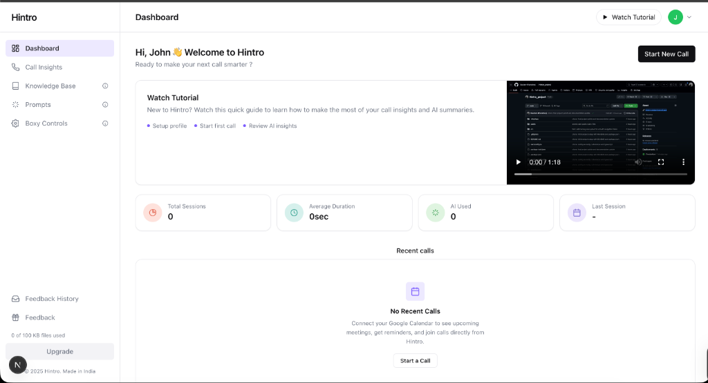
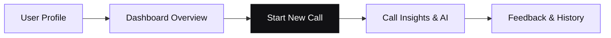

# Hintro Frontend Dashboard

This project is a production-ready dashboard built for the Hintro Frontend Developer Internship assignment. It implements a clean, responsive user interface using Next.js 16, TypeScript, and Tailwind CSS, integrated with a mock backend to demonstrate real-world state management.

## Demo Video

A full walkthrough of the application, showcasing the features and responsiveness, can be found here:
[View Demo Video](./public/Tutorial_video.mov)

## Project Preview



## Application Workflow



## Tech Stack

The application leverages a modern frontend architecture focused on performance and type safety:

- **Framework**: Next.js 16 (App Router)
- **Language**: TypeScript
- **Styling**: Tailwind CSS v3 with CSS Variables for a consistent design system
- **State Management**: React Context API for global user and profile state
- **Network**: Native fetch with custom wrappers for API communication
- **Animations**: Custom CSS keyframes for smooth transitions and interactions

## Setup Instructions

To run the project locally, follow these steps:

1. **Install dependencies**
   ```bash
   npm install
   ```

2. **Start the development server**
   ```bash
   npm run dev
   ```
   Open http://localhost:3000 in your browser.

3. **Build for production**
   ```bash
   npm run build
   npm start
   ```

## User States and Testing

The dashboard is designed to handle different user profiles and data states. You can switch between users through the avatar dropdown in the top navigation bar.

- **User u1 (John Doe)**: Represents a new user experience. This state demonstrates empty data handlers, including placeholder components and initial state visuals.
- **User u2 (Jane Smith)**: Represents an active user. This state is populated with randomized data from the API, demonstrating call history, statistics, and usage metrics.

The selected user ID is persisted in localStorage under the key `hintro.userId` to maintain state across page refreshes.

## API Integration

The application communicates with the Hintro mock backend at `https://mock-backend-hintro.vercel.app`. Each request includes the required `x-user-id` header to fetch the appropriate data for the active session.

Key endpoints used:
- User profile data
- Dashboard overview and usage statistics
- Aggregate call session metrics
- Paginated call history

## Key Assumptions and Implementation Details

- **Client-Side Storage**: User feedback and profile overrides (name and photo) are stored in localStorage rather than a backend database. This ensures persistence during local testing without requiring real authentication.
- **Image Processing**: Profile photos are resized client-side using Canvas before being stored as base64 data URLs in localStorage, preventing excessive storage usage.
- **Design System**: Instead of hardcoding colors, the project uses a centralized CSS variable system in globals.css. This ensures visual consistency across all components and simplifies future theme updates.
- **Responsive Navigation**: The sidebar transitions from a sticky layout on desktop to a mobile-optimized drawer on smaller screens to ensure accessibility across devices.
- **Mock Data Handling**: The application is built to be resilient to API failures, with error states and loading skeletons implemented where necessary.

## Project Structure

- `src/app`: Root layout, global styles, and the main dashboard page.
- `src/components`: Reusable UI components including modals, stat cards, and navigation.
- `src/context`: Global state providers for user identity, feedback storage, and notifications.
- `src/lib`: Utility functions for API communication, data formatting, and image processing.
- `src/public`: Static assets including the tutorial video.
